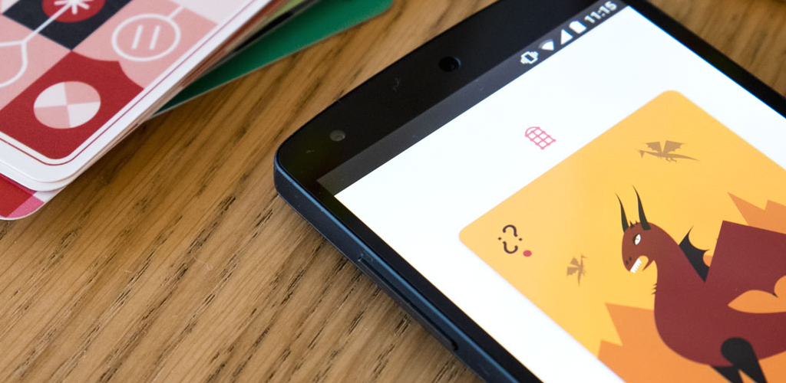

Project Nevada
==============

Planning Time! is the planning poker app designed and developed by Redbooth. Use it to make your sprint planning meetings even more fun! 

Learn the story behind these scrum cards (including the meaning of each card): [scrum-planning-poker-cards](https://redbooth.com/blog/scrum-planning-poker-cards)

But that’s not all! You can also print your own deck. Design is open sourced too and you can find it [here](https://github.com/redbooth/Scrum-poker-cards)

Contributors
============

* Design and Illustration: _Polina Flegontovna_ ([@flegontovna](https://twitter.com/flegontovna))

* Development: _Txus Ballesteros_ ([@txusballesteros](https://twitter.com/txusballesteros)), _Rubén Serrano_ ([@akelael](https://twitter.com/akelael))

License
=======

This program is free software: you can redistribute it and/or modify
it under the terms of the GNU General Public License as published by
the Free Software Foundation, either version 3 of the License, or
(at your option) any later version.

This program is distributed in the hope that it will be useful,
but WITHOUT ANY WARRANTY; without even the implied warranty of
MERCHANTABILITY or FITNESS FOR A PARTICULAR PURPOSE.  See the
GNU General Public License for more details.

You should have received a copy of the GNU General Public License
along with this program.  If not, see <http://www.gnu.org/licenses/>.
